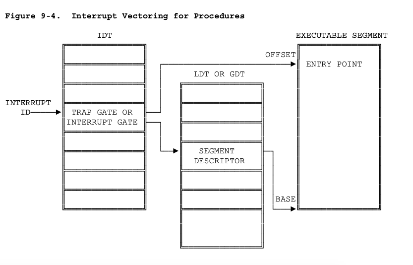

# Interrupts and Exceptions

> 来源: https://pdos.csail.mit.edu/6.828/2018/readings/i386/c09.htm


Interrupts和Exceptions这两个概念经常被混淆使用, 在不同的地方含义会有略微不同.

根据 [https://pdos.csail.mit.edu/6.828/2018/readings/i386/c09.htm](https://pdos.csail.mit.edu/6.828/2018/readings/i386/c09.htm):

The difference between interrupts and exceptions is that interrupts are used to handle asynchronous events external to the processor, but exceptions handle conditions detected by the processor itself in the course of executing instructions. 

here are two sources for external interrupts and two sources for exceptions:

- Interrupts
  
    - Maskable interrupts, which are signalled via the **INTR** pin.
    
    - Nonmaskable interrupts, which are signalled via the **NMI** (Non-Maskable Interrupt) pin. 

- Exceptions
  
  - Processor detected. These are further classified as **faults**, **traps**, and **aborts**.
  
  - Programmed. The instructions INTO, INT 3, INT n, and BOUND can trigger exceptions. These instructions are often called "**software interrupts**", but the processor handles them as exceptions. 


## 中断标识

The NMI and the exceptions recognized by the processor are assigned predetermined identifiers in the range 0 through 31.

The identifiers of the maskable interrupts are determined by **external interrupt controllers** (such as Intel's 8259A Programmable Interrupt Controller) and communicated to the processor during the processor's interrupt-acknowledge sequence.

```
Table 9-1. Interrupt and Exception ID Assignments

Identifier   Description

0            Divide error
1            Debug exceptions
2            Nonmaskable interrupt
3            Breakpoint (one-byte INT 3 instruction)
4            Overflow (INTO instruction)
5            Bounds check (BOUND instruction)
6            Invalid opcode
7            Coprocessor not available
8            Double fault
9            (reserved)
10           Invalid TSS
11           Segment not present
12           Stack exception
13           General protection
14           Page fault
15           (reserved)
16           Coprecessor error
17-31        (reserved)
32-255       Available for external interrupts via INTR pin
```

## IDT




## 其它

### 一些摘录


####  xv6 - 第 3 章

**1**

The x86 has 4 protection levels, numbered 0 (most privilege) to 3 (least privilege). In practice, most operating systems use only 2 levels: 0 and 3, which are then called kernel mode and user mode, respectively. The current privilege level with which the x86 executes instructions is stored in %cs register, in the field CPL.


**2**

To make a system call on the x86, a program invokes the int n instruction, where n specifies the index into the IDT. The int instruction performs the following steps:

- Fetch the n’th descriptor from the IDT, where n is the argument of int.

- Check that CPL in %cs is <= DPL, where DPL is the privilege level in the descriptor.

- Save %esp and %ss in CPU-internal registers, but only if the target segment selector’s PL < CPL.

- Load %ss and %esp from a task segment descriptor.

- Push %ss.

- Push %esp.

- Push %eflags.

- Push %cs.

- Push %eip.

- Clear the IF bit in %eflags, but only on an interrupt.

- Set %cs and %eip to the values in the descriptor.


**3**

For a user program to execute int, the IDT entry’s DPL must be 3. If the user program doesn’t have the appropriate privilege, then int will result in int 13, which is a gener- al protection fault.